# Ranjith Kumar S - GitHub Profile

<div align="center">

<!-- DYNAMIC THEME-AWARE HERO BANNER -->
<picture>
  <source media="(prefers-color-scheme: dark)" srcset="dark.svg">
  <source media="(prefers-color-scheme: light)" srcset="light.svg">
  
</picture>

<br>

<!-- METRICS BADGES (NO EMOJIS TO PREVENT ? ERRORS) -->

&nbsp;

&nbsp;


<br><br>

<!-- SOCIAL Badges -->
<a href="mailto:ranjithk0117@gmail.com">
  
</a>
&nbsp;
<a href="https://linkedin.com/in/ranjith-kumar-0117d">
  
</a>
&nbsp;
<a href="https://github.com/Rks-ranjith">
  
</a>
&nbsp;
<a href="https://tryhackme.com">
  
</a>
&nbsp;
<a href="https://hackerone.com">
  
</a>

</div>

---

```bash
[root@ranjith-kumar:~]# whoami

[+] Name          : Ranjith Kumar S
[+] Specialization: Offensive Security Researcher & AI Security Engineer
[+] Education     : B.Tech CS - Cybersecurity Engineering (CGPA: 8.18/10)
[+] Institution   : GM University, Davanagere, Karnataka, India
[+] Certification : Certified LLM Security Expert (CLLMSE)
[+] Status        : Seeking Offensive Security / AI Security Internship
[+] Location      : Bengaluru, Karnataka, India
[+] Contact       : ranjithk0117@gmail.com | +91 6361602812
```

---

## 0x01 ABOUT ME

```python
class RanjithKumarS:
    def __init__(self):
        self.username = "Rks-ranjith"
        self.focus = ["Offensive Security", "AI / LLM Security Research", "Red Team Operations"]
        self.academic = {
            "degree": "B.Tech in Computer Science (Cybersecurity Engineering)",
            "cgpa": 8.18,
            "status": "Final Year undergraduate"
        }
        self.research_areas = [
            "Autonomous pentesting pipelines (AWAP-AI)",
            "Prompt Injection, RAG and MCP protocol attacks",
            "Active Directory simulation and detection engineering"
        ]

    def get_philosophy(self):
        return "Building autonomous agents to scale adversarial intelligence and secure AI pipelines."
```

- **Offensive Focus**: Actively mapping MITRE ATT&CK techniques in Windows/Active Directory labs and auditing SPA/API vulnerabilities.
- **AI Security Focus**: Specializing in prompt injection chains, indirect prompt injection, and RAG/Agent system security.
- **Bug Bounty**: Independent vulnerability researcher on HackerOne since Sep 2024.

---

## 0x02 TECHNICAL EXPERTISE

```bash
[root@ranjith-kumar:~]# ./list_skills.sh
```

### Languages & Scripts
`Python` `TypeScript` `JavaScript` `SQL` `Bash` `HTML5` `CSS3`

### Offensive Tooling
`Burp Suite` `Nmap` `Metasploit` `Wireshark` `Impacket` `CrackMapExec` `Playwright`

### AI & LLM Security
`Prompt Injection Defense` `RAG Security Auditing` `AI Agent Trust Boundaries` `MCP Protocol Security` `OWASP LLM Top 10`

### Systems & Detection
`Wazuh SIEM` `Sysmon` `Sigma Detection Rules` `MITRE ATT&CK Mapping` `Windows Server (Active Directory)` `Kali Linux` `Ubuntu`

### Infrastructure & Databases
`Docker` `PostgreSQL` `Redis` `Git` `GCP Observability`

---

## 0x03 PRODUCTION PROJECTS

### 0. AWAP-AI: Autonomous Web Application Penetration Testing System
*Autonomous pentesting engine combining finite state machine (FSM) choreography with AI analysis.*
- **Core Architecture**: Engineered a 7-stage automated pentest execution pipeline: Discovery -> Crawling -> Fingerprinting -> Attack Dispatch -> Exploitation -> Verification -> Reporting.
- **Test Engine**: Developed a headless Playwright crawler for SPA path mapping alongside 19 vulnerability-verification modules (SQLi, XSS, IDOR, SSRF, SSTI, Cmd Injection).
- **Control Dashboard**: React + TypeScript frontend displaying real-time telemetry over WebSockets and dynamic target attack graphs.
- **Validation**: Verified against OWASP Juice Shop and DVWA target applications.
- **Tech Stack**: Python, FastAPI, Playwright, React, WebSockets, Redis, PostgreSQL, Docker.

### 1. Active Directory Threat Detection & SIEM Monitoring Lab
*Enterprise simulation lab simulating red team tactics and monitoring with Wazuh SIEM.*
- **Subnet Infrastructure**: Provisioned an isolated 5-VM subnet containing Windows Server 2022 DC, Windows 11 Endpoints, Kali Attacker, and Ubuntu SIEM.
- **Adversary Emulation**: Simulated Kerberoasting, Password Spraying, and Network Reconnaissance via Impacket and CrackMapExec.
- **SIEM / Logging**: Deployed Wazuh 4.7.5 and Windows Sysmon configured with SwiftOnSecurity rules to achieve full coverage.
- **Rule Design**: Authored custom Sigma rules mapping to MITRE ATT&CK for Event ID 4769 (RC4 downgrade) and Event ID 4625 (account lockout correlation).

### 2. Malicious URL Scanner using Machine Learning
*Supervised machine learning pipeline for real-time threat intelligence.*
- **Model Training**: Trained a Random Forest classifier on 650,000+ labeled URLs using structural, lexical, entropy, and domain indicators to achieve 97.12% accuracy.
- **API Integration**: Integrated real-time reputation analysis querying Shodan, VirusTotal, and Google Safe Browsing.

---

## 0x04 CERTIFICATIONS & BENCHMARKS

```
+------------------------------------------------------------+
|  [+] CLLMSE - Certified LLM Security Expert (Jul 2026)      |
|      Red Team Leaders: Prompt Injection, RAG, MCP Security  |
+------------------------------------------------------------+
|  [+] CompTIA Security+ (SY0-701)                            |
|      In Progress - Target: Aug 2026                        |
+------------------------------------------------------------+
|  [+] TryHackMe Profile                                     |
|      Top 10% Global Rank | 65+ Challenge Rooms Completed   |
+------------------------------------------------------------+
|  [+] Tata Group Internship                                 |
|      Cybersecurity Analyst Virtual Program (2024)          |
+------------------------------------------------------------+
```

---

## 0x05 GITHUB METRICS

<div align="center">


<br><br>


<br><br>


</div>

---

## 0x06 CONNECT

```bash
[root@ranjith-kumar:~]# ./get_connect_links.py
```
- **Email**: [ranjithk0117@gmail.com](mailto:ranjithk0117@gmail.com)
- **LinkedIn**: [linkedin.com/in/ranjith-kumar-0117d](https://linkedin.com/in/ranjith-kumar-0117d)
- **GitHub**: [github.com/Rks-ranjith](https://github.com/Rks-ranjith)
- **TryHackMe**: [tryhackme.com/p/Rks.0117](https://tryhackme.com)
- **HackerOne**: [hackerone.com/ranjithk0117](https://hackerone.com)

---

```
+--------------------------------------------------------------------------+
|  "The best offense is understanding defense from the inside out.         |
|   I don't just find vulnerabilities - I build machines that think        |
|   like attackers, so defenders can finally think faster than them."      |
|                                                      - Ranjith Kumar S   |
+--------------------------------------------------------------------------+
```
